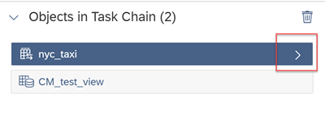
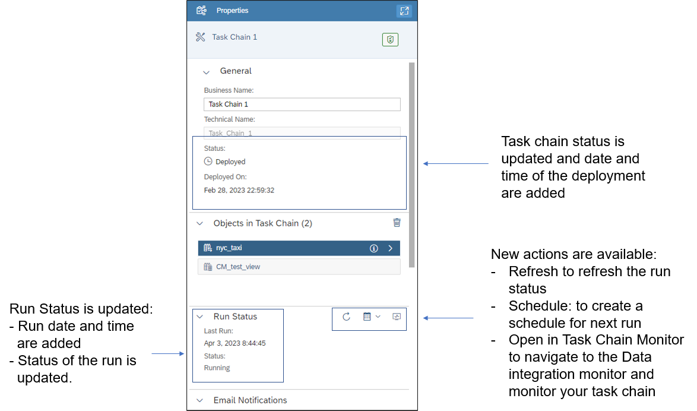
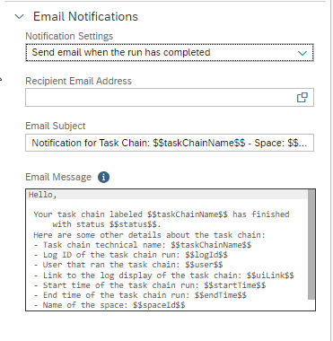

<!-- loiod1afbc2b9ee84d44a00b0b777ac243e1 -->

<link rel="stylesheet" type="text/css" href="../css/sap-icons.css"/>

# Creating a Task Chain

Group multiple tasks into a task chain and run them manually once, or periodically, through a schedule. When creating or editing a task chain, you can also set up email notification for deployed task chains to notify selected users of task chain completion.

<a name="loiod1afbc2b9ee84d44a00b0b777ac243e1__prereq_ccw_sdc_gtb"/>

## Prerequisites

-   You have DW Integrator and DW Modeler role privileges. See [Standard Application Roles](https://help.sap.com/viewer/935116dd7c324355803d4b85809cec97/internal/en-US/a50a51d80d5746c9b805a2aacbb7e4ee.html "SAP Datasphere is delivered with several standard roles.") :arrow_upper_right: for more information.

-   Objects must have been already deployed, so that they can be added to the task chain. Task chains must also be deployed to allow selection of tenant users or specify email addresses for notification of task chain completion.

-   Remote tables must not be set to real-time replication.

-   Views must not have parameters or data access controls assigned to them.

## Context

Task Chains allow you to define a group or series of tasks and execute those tasks in a serial process, one after another. A succeeding task is only executed once the previous task in the series has finished successfully with a *completed* status. The execution of tasks in the series will not resume if the previous task has a *failed* status.

Tasks chain scheduling may include execution of Remote Table Replication, View Persistency, and Data Flow runs.

> ### Note:  
> For optimal performance, it is recommended that you consider staggering the scheduled run time of tasks such as data flows and task chains that may contain these tasks. There is a limit on how many tasks can be started at the same time. If you come close to this limit, scheduled task runs may be delayed and, if you go beyond the limit, some scheduled task runs might even be skipped.

After deploying a task chain, you can add tenant users or email addresses to notify individuals when task chain runs are completed.

You can monitor the status of task chain runs from the Data Integration Monitor. For more information, see [Monitoring Task Chains](https://help.sap.com/viewer/9f36ca35bc6145e4acdef6b4d852d560/internal/en-US/4142201ec1aa49faad89a688a2f1852c.html "Monitor the status and progress of running and previously run task chains.") :arrow_upper_right:.

> ### Note:  
> Exporting and importing task chains via the  \(*Transport*\) app is not supported for SAP Datasphere tenants provisioned prior to version 2021.03.

## Procedure

1.  From the *Data Builder*, click *New Task Chain*.

2.  From the left-side panel, drag and drop objects available in the repository on to the task chain canvas. In addition, you can drag objects already on the task chain canvas, to change the order in which some tasks are executed. The properties panel for the task chain is updated with the added objects.

    > ### Note:  
    > In the repository, you can see the remote tables, views, and data flow objects that meet prerequisites and are available to be added to the task chain.

3.  In the properties panel, specify a name for the task chain.

      

    Task chain properties:

    <table>
    <tr>
    <th valign="top">

    Properties

    
    </th>
    <th valign="top">

    Comments

    
    </th>
    </tr>
    <tr>
    <td valign="top">

    Business Name

    
    </td>
    <td valign="top">

    Name of the task chain

    
    </td>
    </tr>
    <tr>
    <td valign="top">

    Technical Name

    
    </td>
    <td valign="top">

    Technical name of the task chain

    
    </td>
    </tr>
    <tr>
    <td valign="top">

    Status

    
    </td>
    <td valign="top">

    Displays the deployment status of the task chain: it can be deployed, not deployed, or changes to deploy

    
    </td>
    </tr>
    <tr>
    <td valign="top">

    Objects in the task chain

    
    </td>
    <td valign="top">

    Displays all objects that have been added to the task chain

    
    </td>
    </tr>
    <tr>
    <td valign="top">

    Run Status

    
    </td>
    <td valign="top">

    Displays the current run status of the task chain: Not run yet, running, failed, or completed.

    
    </td>
    </tr>
    <tr>
    <td valign="top">

    Email Notifications

    
    </td>
    <td valign="top">

    Set up email notification for task chain run completion.

    
    </td>
    </tr>
    </table>
    
    When you click on one of the task chain objects, the properties for this selected task object is displayed in the properties panel:

      

    Note that you can also access the details of each task chain object in the task chain properties panel. Select the relevant object in the object list and click :

      

    Task chain object properties:

    <table>
    <tr>
    <th valign="top">

    Properties

    
    </th>
    <th valign="top">

    Comments

    
    </th>
    </tr>
    <tr>
    <td valign="top">

    Business Name

    
    </td>
    <td valign="top">

    Name of the object

    
    </td>
    </tr>
    <tr>
    <td valign="top">

    Technical Name

    
    </td>
    <td valign="top">

    Technical name of the object

    
    </td>
    </tr>
    <tr>
    <td valign="top">

    Object Type

    
    </td>
    <td valign="top">

    A remote table, view, or data flow

    
    </td>
    </tr>
    <tr>
    <td valign="top">

    Activity

    
    </td>
    <td valign="top">

    Activity that will be triggered by the task chain:

    -   Remote table - Replicate

    -   View - Persist
    -   Data flow - Run

    
    </td>
    </tr>
    <tr>
    <td valign="top">

    Status

    
    </td>
    <td valign="top">

    Deployment status of the task chain: it can be deployed, not deployed, or changes to deploy

    
    </td>
    </tr>
    </table>
    
    > ### Note:  
    > When you select an object, you can delete it from the task chain or navigate to the corresponding editor.

4.  Save and deploy your task chain.

    The properties of your task chain is updated.

      

    Once the task chain is deployed, you can then run the task chain or create a schedule to run your task chain periodically, and navigate to the Task Chain Monitor to monitor your task chain runs. For more information, see [Scheduling Data Integration Tasks](https://help.sap.com/viewer/9f36ca35bc6145e4acdef6b4d852d560/internal/en-US/7fa07621d9c0452a978cb2cc8e4cd2b1.html "Schedule data integration tasks to run periodically at a specified date or time.") :arrow_upper_right: and [Monitoring Task Chains](https://help.sap.com/viewer/9f36ca35bc6145e4acdef6b4d852d560/internal/en-US/4142201ec1aa49faad89a688a2f1852c.html "Monitor the status and progress of running and previously run task chains.") :arrow_upper_right:.

5.  **Configuring Email Notifications**

    After creating and deploying a task chain, you can set up email notification for completion of task chain runs.

    To set up email notification:

6.  In the *Email Notifications* section of the *Properties* panel, select when you want notifications to be sent for the current task chain. You can choose from the following options:

    -   Send email notification only when the run has completed with an error.

    -   Send email notification only when the run has completed successfully.

    -   Send email notification when the run has completed.

    The *Email Notifications* section expands to show details of the email notification message to be sent to users on completion of task chain runs.

      

    The notification setup includes a default template you can customize for both the email message subject and body text. You can choose to send notifications to other tenant users or specify email addresses of other users to receive notifications \(up to 20 recipients total\). Email addresses must be in the same domain as the tenant owner.

    > ### Note:  
    > Task chains must also first be deployed before you can select or specify users to receive notifications.

7.  Click the  link on the right side of the *Recipient Email Address* field to open a popup dialog in which you can add recipients of task chain notification email messages.

      

    From this dialog, you can select member users of the same tenant or click the *Others* tab to specify email addresses of other users you want to receive notifications \(up to 20 total recipients\). Email addresses must match the domain of the tenant owner, for example, jdoe@sap.com. After saving your selections, the display returns to the *Properties* panel, showing the selected users in the *Recipient Email Address* field.

8.  Review the default email subject and message body text and make any updates to either the text or placeholder variables used in the notification email message sent for the current task chain.

    Placeholder variables within the subject and message fields are enclosed by $$ characters, for example, $$status$$. You can click the  icon to display a list of available placeholder variable names you may include in either the email subject or message body text fields.

    > ### Note:  
    > Changes you make to the email notification template are saved when you redeploy the updated task chain that has email notification subject and body text template changes. When the task chain is run and notification emails are sent out, placeholder variables in the notification template will be replaced with actual values available at runtime.

