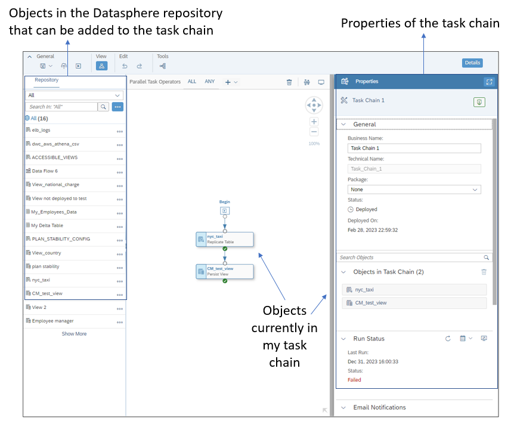
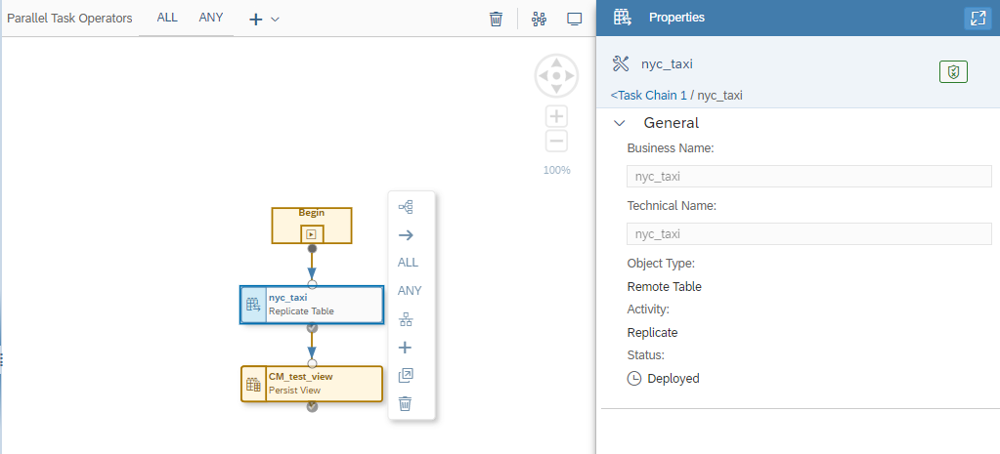
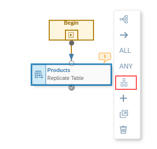
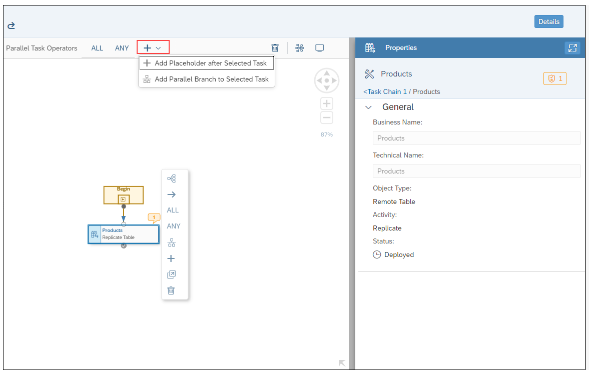
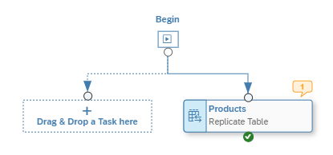
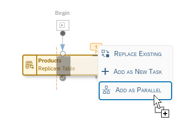
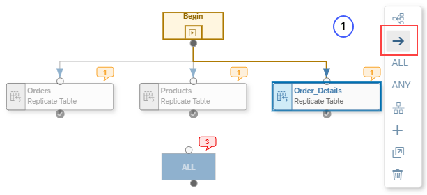
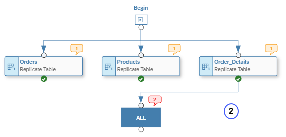
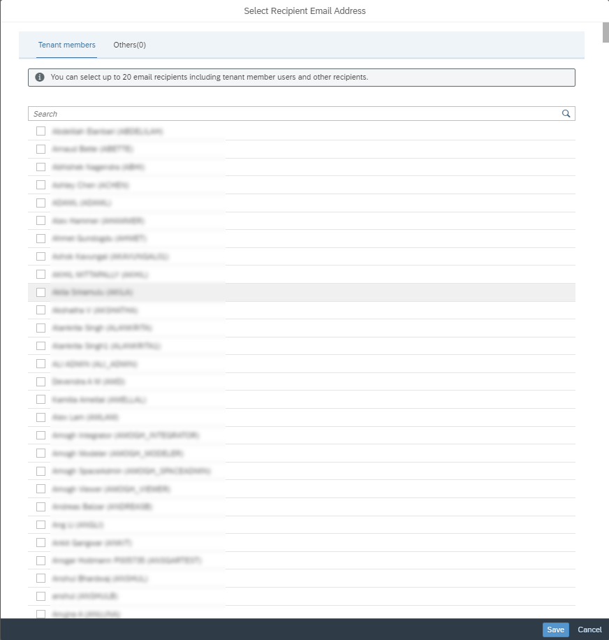

<!-- loiod1afbc2b9ee84d44a00b0b777ac243e1 -->

<link rel="stylesheet" type="text/css" href="../css/sap-icons.css"/>

# Creating a Task Chain

Group multiple tasks into a task chain and run them manually once, or periodically, through a schedule. You can create linear task chains in which one task is run after another. Or, you can create task chains in which individual tasks are run in parallel and successful continuation of the entire task chain run depends on whether ANY or ALL parallel tasks are completed successfully. In addition, when creating or editing a task chain, you can also set up email notification for deployed task chains to notify selected users of task chain completion.

<a name="loiod1afbc2b9ee84d44a00b0b777ac243e1__prereq_ccw_sdc_gtb"/>

## Prerequisites

-   The DW Modeler role is required to create task chains, and the additional DW Integrator role is required to set up email notification for completion of executed task chains, and to run the activity *Delete Records with Change Type "Deleted"* in the case of local table with delta capture enabled. For more information, see [Standard Roles Delivered with SAP Datasphere](https://help.sap.com/viewer/935116dd7c324355803d4b85809cec97/DEV_CURRENT/en-US/a50a51d80d5746c9b805a2aacbb7e4ee.html "SAP Datasphere is delivered with several standard roles. A standard role includes a predefined set of privileges and permissions.") :arrow_upper_right:. In addition to these two role privileges, when setting up email notifications, either the Team.Read or User.Read privilege is also required to display and add notification recipients from a list of current tenant members. See [Privileges and Permissions](https://help.sap.com/viewer/935116dd7c324355803d4b85809cec97/DEV_CURRENT/en-US/d7350c6823a14733a7a5727bad8371aa.html "A privilege represents a task or an area in SAP Datasphere and can be assigned to a specific role. The actions that can be performed in the area are determined by the permissions assigned to a privilege.") :arrow_upper_right:.

-   Objects must have been already deployed, so that they can be added to the task chain. Task chains must also be deployed to allow selection of tenant users or specify email addresses for notification of task chain completion.

-   Remote tables must not be set to real-time replication.

-   Views must not have parameters or data access controls assigned to them.

-   If a data flow that has input parameters is included in a task chain, task chain runs will use default parameter values defined for the data flow.

## Context

Linear task chains allow you to define a group or series of tasks and execute those tasks in a serial process, one after another. A succeeding task is only executed once the previous task in the series has finished successfully with a *completed* status. The execution of tasks in the series will not resume if the previous task has a *failed* status.

Parallel task chain branches allow you to specify that some individual tasks are run in parallel and successful continuation of the entire task chain run depends on whether ANY or ALL parallel tasks are completed successfully.

Tasks chain scheduling may include execution of Remote Table Replication, View Persistency, Intelligent Lookup, Data Flow, and Transformation Flow runs.

> ### Note:  
> For optimal performance, it is recommended that you consider staggering the scheduled run time of tasks such as data flows and task chains that may contain these tasks. There is a limit on how many tasks can be started at the same time. If you come close to this limit, scheduled task runs may be delayed and, if you go beyond the limit, some scheduled task runs might even be skipped.

After deploying a task chain, you can add tenant users or email addresses to notify individuals when task chain runs are completed.

You can monitor the status of task chain runs from the Data Integration Monitor. For more information, see [Monitoring Task Chains](https://help.sap.com/viewer/9f36ca35bc6145e4acdef6b4d852d560/DEV_CURRENT/en-US/4142201ec1aa49faad89a688a2f1852c.html "Monitor the status and progress of running and previously run task chains.") :arrow_upper_right:.

> ### Note:  
> Exporting and importing task chains via the  \(*Transport*\) app may not be supported for SAP Datasphere tenants provisioned prior to version 2021.03. To request the migration of your tenant, see SAP note [3268282](https://launchpad.support.sap.com/#/notes/3268282).

This topic contains information on performing the following tasks:

-   Basic linear task chain creation

-   Creation of parallel task branches in chains

-   Task chain email notification

## Procedure

**Basic Creation of a Linear Task Chain**

A basic or linear task chain allows you to define a group or series of tasks and execute those tasks in a serial process, one after another. A succeeding task is only executed once the previous task in the series has finished successfully with a completed status. The execution of tasks in the series will not resume if the previous task has a failed status.

1.  From the *Data Builder*, click *New Task Chain*.

2.  From the left-side panel, drag and drop a first object on to the task chain canvas from those available in the repository.

    > ### Note:  
    > In the repository, you can see the remote tables, views, intelligent lookups, data flow, and transformation flow objects that meet prerequisites and are available to be added to the task chain.

    > ### Note:  
    > If you add a remote table whose data access is *Replicated \(Real-time\)* in a task chain, the replication type will change from real-time replication to batch replication at the next run of the task chain. The data will no longer be updated in real-time.

3.  Drag a second object on to the first object in the task chain. As you drag the object over the top of the first object, a context menu displays options *Add as New Task* \(the default\), *Replace Existing*, or *Add as Parallel* \(described in the next section\) to place the new object.

    Choosing the *Add as New Task* option automatically connects the new object task to the previous object task. The properties panel for the task chain is also updated with the added objects.

4.  Continue adding remaining object tasks you want to include in the task chain.

    In addition to adding or replacing object tasks in a task chain, you can drag objects already on the task chain canvas to change the order in which tasks are executed.

5.  In the properties panel, specify a name for the task chain.

    

    Task chain properties:

    <table>
    <tr>
    <th valign="top">

    Properties
    
    </th>
    <th valign="top">

    Comments
    
    </th>
    </tr>
    <tr>
    <td valign="top">
    
    Business Name
    
    </td>
    <td valign="top">
    
    Name of the task chain
    
    </td>
    </tr>
    <tr>
    <td valign="top">
    
    Technical Name
    
    </td>
    <td valign="top">
    
    Technical name of the task chain
    
    </td>
    </tr>
    <tr>
    <td valign="top">
    
    Package
    
    </td>
    <td valign="top">
    
    Select the package to which the object belongs. 

    Packages are used to group related objects in order to facilitate their transport between tenants.

    > ### Note:  
    > Once a package is selected, it cannot be changed here. Only a user with the DW Space Administrator role \(or equivalent privileges\) can modify a package assignment in the *Packages* editor.

    For more information, see [Creating Packages to Export](https://help.sap.com/viewer/9f36ca35bc6145e4acdef6b4d852d560/DEV_CURRENT/en-US/24aba84ceeb3416881736f70f02e3a0a.html "Users with the DW Space Administrator role can create packages to model groups of related objects for transport between tenants. Modelers can add objects to packages via the Package field, which appears in editors when a package is created in their space. Once a package is complete and validated, the space administrator can export it to the Content Network. The structure of your package is preserved and, as the objects it contains evolve, you can easily export updated versions of it.") :arrow_upper_right:.
    
    </td>
    </tr>
    <tr>
    <td valign="top">
    
    Status
    
    </td>
    <td valign="top">
    
    Displays the deployment status of the task chain: it can be deployed, not deployed, or changes to deploy
    
    </td>
    </tr>
    <tr>
    <td valign="top">
    
    Objects in the task chain
    
    </td>
    <td valign="top">
    
    Displays all objects that have been added to the task chain
    
    </td>
    </tr>
    <tr>
    <td valign="top">
    
    Run Status
    
    </td>
    <td valign="top">
    
    Displays the current run status of the task chain: Not run yet, running, failed, or completed.
    
    </td>
    </tr>
    <tr>
    <td valign="top">
    
    Email Notifications
    
    </td>
    <td valign="top">
    
    Set up email notification for task chain run completion.
    
    </td>
    </tr>
    </table>
    
    When you click on one of the task chain objects, the properties for this selected task object is displayed in the properties panel:

    

    Note that you can also access the details of each task chain object in the task chain properties panel. Select the relevant object in the object list and click :

    

    Task chain object properties:

    <table>
    <tr>
    <th valign="top">

    Properties
    
    </th>
    <th valign="top">

    Comments
    
    </th>
    </tr>
    <tr>
    <td valign="top">
    
    Business Name
    
    </td>
    <td valign="top">
    
    Name of the object
    
    </td>
    </tr>
    <tr>
    <td valign="top">
    
    Technical Name
    
    </td>
    <td valign="top">
    
    Technical name of the object
    
    </td>
    </tr>
    <tr>
    <td valign="top">
    
    Object Type
    
    </td>
    <td valign="top">
    
    A remote table, view, intelligent lookup, data flow, or transformation flow
    
    </td>
    </tr>
    <tr>
    <td valign="top">
    
    Activity
    
    </td>
    <td valign="top">
    
    Activity that will be triggered by the task chain:

    -   Remote table - Replicate

    -   View - Persist
    -   Intelligent lookup - Run
    -   Data flow - Run
    -   Transformation flow - Run
    -   Local table - Delete Records with Change Type "Deleted"

    
    </td>
    </tr>
    <tr>
    <td valign="top">
    
    Status
    
    </td>
    <td valign="top">
    
    Deployment status of the task chain: it can be deployed, not deployed, or changes to deploy
    
    </td>
    </tr>
    </table>
    
    > ### Note:  
    > When you select an object, you can delete it from the task chain or navigate to the corresponding editor for that object.

6.  Save and deploy your task chain.

    The properties of your task chain are updated.

    

    Once the task chain is deployed, you can then run the task chain or create a schedule to run your task chain periodically, and navigate to the *Task Chains* monitor to chech your task chain runs. For more information, see [Scheduling Data Integration Tasks](https://help.sap.com/viewer/9f36ca35bc6145e4acdef6b4d852d560/DEV_CURRENT/en-US/7fa07621d9c0452a978cb2cc8e4cd2b1.html "Schedule data integration tasks to run periodically at a specified date or time.") :arrow_upper_right: and [Monitoring Task Chains](https://help.sap.com/viewer/9f36ca35bc6145e4acdef6b4d852d560/DEV_CURRENT/en-US/4142201ec1aa49faad89a688a2f1852c.html "Monitor the status and progress of running and previously run task chains.") :arrow_upper_right:.

**Executing Parallel Tasks in a Task Chain**

In addition to linear task chains in which one task is executed after another, you can also create task chains in which individual tasks are run in parallel and continuation of the entire task chain run depends on whether ANY or ALL parallel tasks are completed successfully.

7.  After adding an object to the task chain canvas, there are a few different ways in which you can specify that the object or task you added is part of a parallel branch in the task chain:

    -   Select the task object you added to the canvas and then click the *Add as Parallel Branch* option from the list of context menu options available.

        

    -   Alternatively, you can select the task object, click  Add from the shell bar above the canvas, and select the *Add Parallel Branch to Selected Task* menu option.

        

        If you choose either of these options, a new task placeholder is added to the canvas, next to the currently selected task object.

        

        You can then drag another task object on to the canvas to take the place of the new task placeholder.

        > ### Note:  
        > The task chain editor displays indications of warnings and errors with the bubble icon appearing next to specific task objects. You can click on an individual bubble to view the specific warning or error that was detected; for example, if a specific task was already included in another task chain, or if you need to make additional changes or updates to the task chain for it to be deployed and run.

    -   Another way to create a parallel branch in a task chain is simply to drag a new object to the canvas on top of the currently selected task object and then choose the *Add as Parallel* context menu option.

        

        Following this selection, the new task object will be placed next to the currently selected object. For example:

        

        You may continue to add additional parallel task objects in the same way. There is no predefined limit on the number of tasks you can include in a parallel task chain branch, however you cannot nest another task chain within an existing one.

8.  When you have finished adding task objects to the parallel task chain branch, select the ANY or ALL operator to apply to the execution of the parallel task objects in the chain.

    To do that, select one of the parallel branch task objects and select either the *ANY* or *ALL* operator from the task object’s context menu. Or, you can click and drag the ANY or ALL operator from the shell bar on to the task chain canvas below the parallel task chain branch you’ve created.

    > ### Note:  
    > To switch the ANY or ALL operator, after adding it to the task chain canvas, simply select the current operator and then toggle the ANY/ALL option in the task chain's Properties panel.

9.  Next, connect each of the parallel branch task objects to the ANY or ALL operator you placed on the canvas. To do that, select a task object in the branch, then click and drag the :arrow_right: arrow to the ANY or ALL operator to connect the selected task object.

    

    

10. Connect the remaining task objects in the branch to the ANY or ALL operator, in the same way, to complete creation of the parallel task chain branch.

    Following the completion of the task chain branch, you can then continue to add additional linear tasks, or create additional task object branches in the task chain.

11. When you’ve finished adding tasks objects to the task chain, save and deploy your new task chain.

    > ### Note:  
    > SAP Datasphere allows you to save task chains that may have unconnected task objects on the canvas. However, you will not be able to deploy and run them until all task objects are connected to define their order of execution when the task chain is run.

    When a task chain is run that includes a parallel task chain branch, execution of all the branch tasks are triggered to be run in parallel. The ANY or ALL condition applied to the branch specifies whether ANY or ALL branch tasks must be completed successfully to continue with execution of remaining tasks in the chain.

    A task chain will continue running as long as possible. Until all tasks in the chain have been executed and are in a non-running state, the task chain itself is considered to be "running". When finished, the overall state or status of the task chain will be reported as “failed” if any task in the chain is "failed". The final status of COMPLETED for a task chain is reported only if all tasks are COMPLETED.

    After finishing a task chain run that includes one or more parallel task branches, it may be possible that one or more tasks may be reported in an error state \(in each branch\). For example, in branches where completion of tasks is evaluated with the ANY operator. In that case, if you restart or retry the task chain, SAP Datasphere will then restart previously-failed tasks and run all subsequent tasks that had not yet run. In particular, this means that if a failed task is in a parallel branch which was evaluated with the ANY operator, those tasks in the same branch which had run successfully will not be run again. Only those tasks that have failed will be retried or run again.

**Configuring Email Notifications**

After creating and deploying a task chain, you can set up email notification for completion of task chain runs.

> ### Note:  
> The DW Integrator role is required to set up email notification for completion of executed task chains. The *Email Notifications* section of the task chain *Properties* panel will not appear if you do not have this privilege assigned. For more information ,see [Standard Roles Delivered with SAP Datasphere](https://help.sap.com/viewer/935116dd7c324355803d4b85809cec97/DEV_CURRENT/en-US/a50a51d80d5746c9b805a2aacbb7e4ee.html "SAP Datasphere is delivered with several standard roles. A standard role includes a predefined set of privileges and permissions.") :arrow_upper_right:. In addition to the DW Integrator role, when setting up email notifications, either the Team.Read or User.Read privilege is also required to display and add notification recipients from a list of current tenant members.

To set up email notification:

12. In the *Email Notifications* section of the *Properties* panel, select when you want notifications to be sent for the current task chain. You can choose from the following options:

    -   Send email notification only when the run has completed with an error.

    -   Send email notification only when the run has completed successfully.

    -   Send email notification when the run has completed.

    The *Email Notifications* section expands to show details of the email notification message to be sent to users on completion of task chain runs.

    

    The notification setup includes a default template you can customize for both the email message subject and body text. You can choose to send notifications to other tenant users or specify email addresses of other users to receive notifications \(up to 20 recipients total\). Email addresses must be in the same domain as the tenant owner.

    > ### Note:  
    > Task chains must also first be deployed before you can select or specify users to receive notifications.

13. Click the  link on the right side of the *Recipient Email Address* field to open a popup dialog in which you can add recipients of task chain notification email messages.

    

    From this dialog, you can select member users of the same tenant or click the *Others* tab to specify email addresses of other users you want to receive notifications \(up to 20 total recipients\). Email addresses must match the domain of the tenant owner, for example, jdoe@sap.com. After saving your selections, the display returns to the *Properties* panel, showing the selected users in the *Recipient Email Address* field.

    > ### Note:  
    > When setting up email notification, either the Team.Read or User.Read privilege is required to be able to display and add notification recipients from the list of current tenant members. If you do not have this privilege assigned, you can still add recipients manually from the *Others* tab.

14. Review the default email subject and message body text and make any updates to either the text or placeholder variables used in the notification email message sent for the current task chain.

    Placeholder variables within the subject and message fields are enclosed by $$ characters, for example, $$status$$. You can click the  icon to display a list of available placeholder variable names you may include in either the email subject or message body text fields.

    > ### Note:  
    > Changes you make to the email notification template are saved when you redeploy the updated task chain that has email notification subject and body text template changes. When the task chain is run and notification emails are sent out, placeholder variables in the notification template will be replaced with actual values available at runtime. You should note, however, that no email notifications will be sent out if any error occurs during initialization or preparation to run a task chain, before task execution actually starts.

