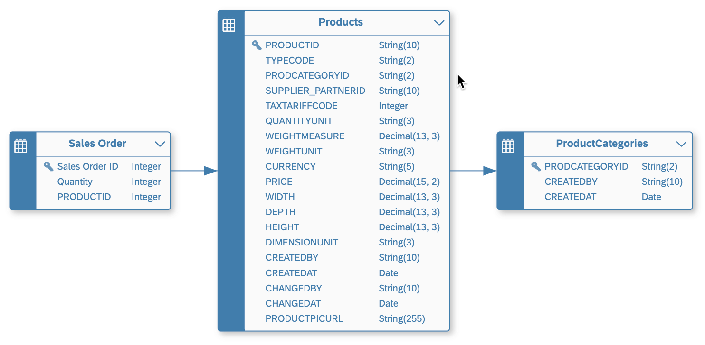

<!-- loio66c6998af9974dac8f54a46515777560 -->

<link rel="stylesheet" type="text/css" href="css/sap-icons.css"/>

# Create an Association

Click the *Create* button in the *Associations* section of the side panel of your table or view to create an association to another data entity. You can create an association from any table or view to any other table or view at any level of the data layer, including to define the relationships between facts and dimensions among your consumable views.

## Context

You can create associations in the:

-   E/R model editor \(for any table or view\), in the side panel *Associations* section or by drawing associations in the diagram \(see [Create an Association in an E/R Model Diagram](create-an-association-in-an-e-r-model-diagram-82e6869.md)\).
-   Table editor *Associations* section.
-   Graphical view editor/SQL view editor, in the output node *Associations* section.

In this example:

-   The `Sales Order` table has a semantic usage of *Fact* and has an association from its `Product ID` column to the `Product ID` key of the `Products` table, which is a *Dimension*.
-   The `Products` *Dimension* has an association from its `PRODCATEGORYID` column to the `PRODCATEGORYID` key of the `Product Categories` table, which is also a *Dimension*.

<a name="loio66c6998af9974dac8f54a46515777560__steps_lz1_1cx_n4b"/>

## Procedure

1.  Open the table or view that will be the source of your association \(or select it in an E/R model to open its *Properties* panel\).

2.  In the *Associations* section, click  \(Create Association\) to open the *Select Association Target* dialog.

3.  You can filter the list of available targets by name and type. Select the appropriate target data entity from the list and click *OK* to create the association and open it in the side panel.

    The rules for creating associations depend on the *Semantic Usage* of the entity:

    -   A *Fact* can point to a:

        -   *Dimension* - One attribute in the \(source\) *Fact* must be mapped to each \(target\) *Dimension* key column so that all target key columns are mapped.
        -   *Text Entity* - An attribute in the \(source\) *Fact* must be mapped to the \(target\) *Text Entity* identifier key column.

    -   A *Dimension* can point to a:

        -   *Dimension* - One attribute in the \(source\) *Dimension* must be mapped to each \(target\) *Dimension* key column so that all target key columns are mapped.
        -   *Text Entity* - An attribute in the \(source\) *Dimension* must be mapped to the \(target\) *Text Entity* identifier key column.
        -   *Hierarchy* - The key attribute in the \(source\) *Dimension* must be mapped to the \(target\) *Hierarchy* child attribute key column.

    -   A *Text Entity* must not point to other entities.

    -   A *Hierarchy* will generally not point to other entities.

    -   A *Relational Dataset* can point to any other entity and should generally follow the rules for dimensions.

4.  In the *General* section, review the default *Business Name* and *Technical Name* and modify them if appropriate.

5.  Specify the mapping of join columns in the *Join* section:

    -   A default mapping is automatically created by matching column names if possible. For example if the originating entity contains a column, `Product ID`, and the target entity has a column with the same name, then a default mapping is created between these two columns.
    -   To delete a mapping, select the link and then click  \(Delete\).
    -   To manually map columns, drag a column from the left list and drop it onto a column in the right list.
    -   You can filter the *Join* section to show only mapped or unmapped pairs of columns.
    -   You can filter or sort the left or right column lists independently

    > ### Note:  
    > To delete an association, select it in the list and click  \(Delete Association\).

6.  If the view builds on another source view that itself has an association, you can copy that association:

    1.  Click  \(Create Association\) \> *Copy from Source*. The *Copy Associations from Source* dialog opens and shows a table containing all source associations available to copy.
    2.  Select the association\(s\) to copy and click *Create*. The new association\(s\) is added in the *Association* section in the output node's side panel.

