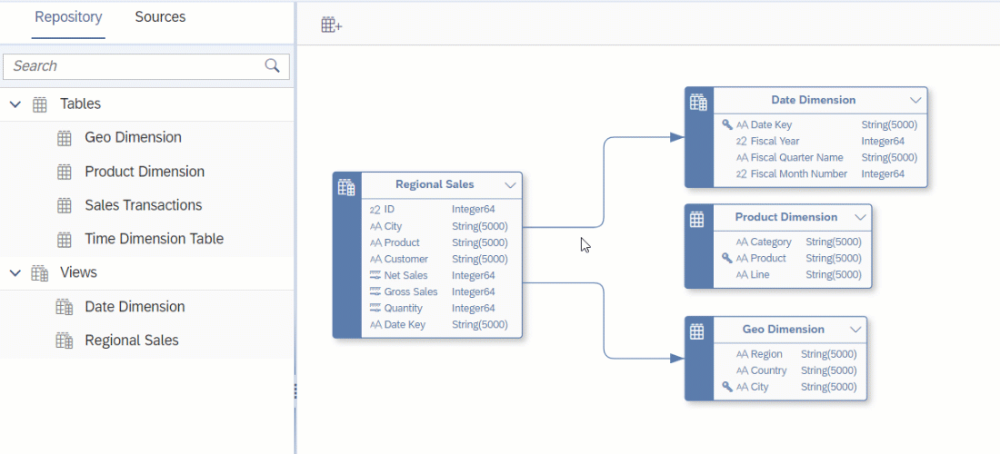

<!-- loio82e686959bb449d382417eee8198f6e2 -->

<link rel="stylesheet" type="text/css" href="css/sap-icons.css"/>

# Create an Association in an E/R Model Diagram

Create an association between two entities graphically in an E/R model diagram.

## Context

In addition to this method, you can also create associations in the side panel in an E/R model, or in the table editor, graphical view editor, or SQL view editor \(see [Create an Association](create-an-association-66c6998.md)\).

## Procedure

1.  Select an object to open its context menu.

2.  Click and hold:arrow_right:, then release once you've placed your cursor over the target object.

    

    The rules for creating associations depend on the *Semantic Usage* of the entity:

    -   A *Fact* can point to a:

        -   *Dimension* - One attribute in the \(source\) *Fact* must be mapped to each \(target\) *Dimension* key column so that all target key columns are mapped.
        -   *Text Entity* - An attribute in the \(source\) *Fact* must be mapped to the \(target\) *Text Entity* identifier key column.

    -   A *Dimension* can point to a:

        -   *Dimension* - One attribute in the \(source\) *Dimension* must be mapped to each \(target\) *Dimension* key column so that all target key columns are mapped.
        -   *Text Entity* - An attribute in the \(source\) *Dimension* must be mapped to the \(target\) *Text Entity* identifier key column.
        -   *Hierarchy* - The key attribute in the \(source\) *Dimension* must be mapped to the \(target\) *Hierarchy* child attribute key column.

    -   A *Text Entity* must not point to other entities.

    -   A *Hierarchy* will generally not point to other entities.

    -   A *Hierarchy with Directory* must point to:

        -   A *Dimension* acting as its directory - The hierarchy name attribute in the \(source\) hierarchy entity must be mapped to the primary key column in the \(target\) dimension.
        -   Any non-leaf *Dimension* providing nodes to the hierarchy - The appropriate node type values columns in the \(source\) hierarchy must be mapped to the key columns in the \(target\) *Dimension*.

    -   A *Relational Dataset* can point to any other entity and should generally follow the rules for dimensions.

3.  In the *General* section, review the default *Business Name* and *Technical Name* and modify them if appropriate.

4.  Specify the mapping of join columns in the *Join* section:

    -   A default mapping is automatically created by matching column names if possible. For example if the originating entity contains a column, `Product ID`, and the target entity has a column with the same name, then a default mapping is created between these two columns.
    -   To delete a mapping, select the link and then click  \(Delete\).
    -   To manually map columns, drag a column from the left list and drop it onto a column in the right list.
    -   You can filter the *Join* section to show only mapped or unmapped pairs of columns.
    -   You can filter or sort the left or right column lists independently

    > ### Note:  
    > To delete an association, select it in the list and click  \(Delete Association\).

5.  To delete an association, select the arrow and click  \(Delete Association\).

