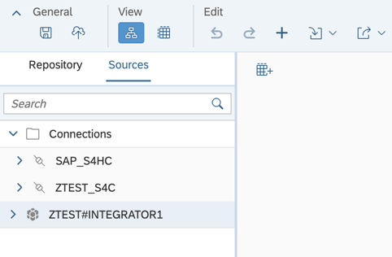
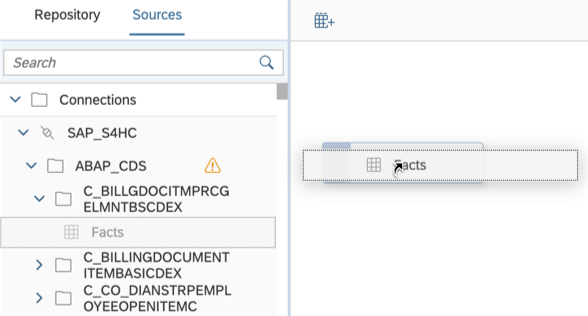
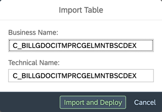
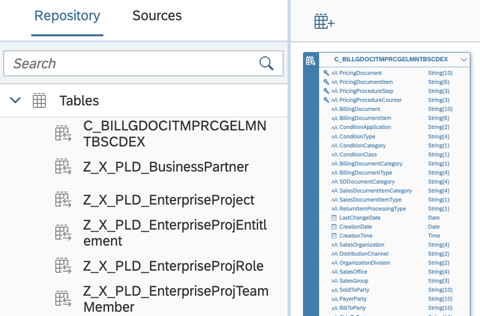

<!-- loio3e6f8f274e1d42759f536d3004025d24 -->

<link rel="stylesheet" type="text/css" href="css/sap-icons.css"/>

# Import an Object from a Connection or Other Source

Drag objects from the *Sources* tab of the *Source Browser* to add them as sources in your data flow, graphical view, or SQL view. In an E/R model, you can add objects from any connections and other sources, and prepare them for use in other editors.

<a name="loio3e6f8f274e1d42759f536d3004025d24__context_hbr_k4y_jsb"/>

## Context

> ### Note:  
> In the data flow editor, tables taken from connections are simply connected to \(and not imported\).

<a name="loio3e6f8f274e1d42759f536d3004025d24__steps_qjw_4c4_ppb"/>

## Procedure

1.  If the *Source Browser* panel is not visible on the left of the screen, click *Source Browser* in the toolbar to show it.

2.  Click the *Sources* tab.

    The *Sources* tab lists all the connections and other data sources that have been integrated to the space from which you can import tables. These can include: 

    -   *Connections* - Lists all the connections that have been created in the space \(see [Integrating Data via Connections](https://help.sap.com/viewer/9f36ca35bc6145e4acdef6b4d852d560/DEV_CURRENT/en-US/eb85e157ab654152bd68a8714036e463.html "Connections provide access to data from a wide range of remote systems, cloud as well as on-premise, SAP as well as Non-SAP, and partner tools. They allow users assigned to a space to use objects from the connected remote system as source to acquire, prepare and access data from those sources in SAP Datasphere. In addition, you can use certain connections to define targets for replication flows.") :arrow_upper_right:\).

        You can browse and search on up to 1,000 objects per connection. To browse all available objects, hover over any schema and click  \(Import from Connection\) to open the *Import Objects from Connection* dialog \(see [Import Multiple Objects from a Connection](import-multiple-objects-from-a-connection-e720b13.md)\).

    -   Open SQL Schemas - Each Open SQL schema appears as a root node in this tab \(see [Integrating Data via Database Users/Open SQL Schemas](https://help.sap.com/viewer/9f36ca35bc6145e4acdef6b4d852d560/DEV_CURRENT/en-US/3de55a78a4614deda589633baea28645.html "Create a database user in your space to read and write directly to the SAP HANA Cloud database on which SAP Datasphere runs. Each database user has an Open SQL schema, which is attached to a space schema and provides a secure method for exchanging data with the space.") :arrow_upper_right:\).
    -   HDI Containers - Each SAP HDI container added to the space appears as a root node in this tab \(see [Exchanging Data with SAP SQL Data Warehousing HDI Containers](https://help.sap.com/viewer/9f36ca35bc6145e4acdef6b4d852d560/DEV_CURRENT/en-US/1aec7ca95af24208a61c1a444b249d95.html "Use SAP SQL Data Warehousing to build calculation views and other SAP HANA Cloud HDI objects directly in your SAP Datasphere run-time database and then exchange data between your HDI containers and your SAP Datasphere spaces. SAP SQL Data Warehousing can be used to bring existing HDI objects into your SAP Datasphere environment, and to allow users familiar with the HDI tools to leverage advanced SAP HANA Cloud features.") :arrow_upper_right:\).

    

3.  Expand the source from which you want to import a table and then expand any sub-folders until you arrive at the table you want to import:

    

4.  Drag the table you want to import and drop it on the diagram canvas:

    

5.  In the *Import Table* dialog, accept the default business and technical names or overwrite them and then click *Import and Deploy*:

    

    The source is added to your diagram and is imported to the repository. From now on it is available to everyone in your space on the *Repository* tab of the *Source Browser*:

    -   Connections - Tables are imported as remote tables

        > ### Note:  
        > In the data flow editor, tables taken from connections are simply connected to \(and not imported\).

    -   Open SQL queries - Tables are imported as local tables
    -   HDI containers - Tables are imported as local tables

    

