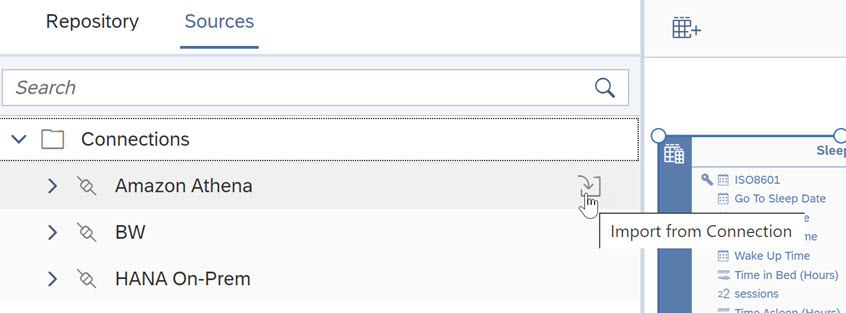

<!-- loioe720b1383b154bd6b0aac64baf52a10b -->

<link rel="stylesheet" type="text/css" href="css/sap-icons.css"/>

# Import Multiple Objects from a Connection

Use the *Import Objects from Connection* dialog to select multiple objects from a connection to add as sources in your data flow, graphical view, or SQL view. In an E/R model, you can add objects from a connections, and prepare them for use in other editors.

<a name="loioe720b1383b154bd6b0aac64baf52a10b__context_hbr_k4y_jsb"/>

## Context

> ### Note:  
> In the data flow editor, tables taken from connections are simply connected to \(and not imported\).

<a name="loioe720b1383b154bd6b0aac64baf52a10b__steps_qjw_4c4_ppb"/>

## Procedure

1.  Click the *Sources* tab of the *Source Browser*, expand the *Connections* node, and then hover over a sub-node and click the  \(Import from Connection\) button:

    

    Alternatively, in an E/R model, click  \(Import\) in the toolbar, select a connection, and click *Next*.

    The *Import Objects from Connection* dialog opens on the selected connection.

    > ### Note:  
    > ABAP SLT connections do not support selecting objects from this dialog \(see [SAP ABAP Connections](https://help.sap.com/viewer/9f36ca35bc6145e4acdef6b4d852d560/DEV_CURRENT/en-US/a75c1aacf951449ba3b740c7e46da3a9.html "Use an SAP ABAP connection to access data from SAP ABAP on-premise systems through RFC or to access data from cloud source systems such as SAP S/4HANA Cloud through Web Socket RFC.") :arrow_upper_right:\).

2.  On the *Available* tab:

    1.  Navigate in the connection in the left pane, and click a folder in the tree to show its contents in the right pane.

    2.  Select objects to be imported in the right pane.

    3.  \[optional\] Select further folders and select additional objects to be imported from them.

    4.  When all appropriate objects are selected, click *Next* \(or click the *Selection* tab\).

3.  On the *Selection* tab:

    1.  Review the objects selected.

    2.  \[optional\] Modify the *Business Name* and/or *Technical Name* of one or more of the selected objects. These names are used to identify the objects in SAP Datasphere. While you can edit a *Business Name* at any time, the *Technical Name* cannot be edited after an object is imported.

        > ### Note:  
        > In the data flow editor, tables are simply connected to \(and not imported\) and there is therefore no need or option to set these names.

    3.  \[optional\] To remove an object from the selection, select it and click *Remove from Selection*.

4.  When you are satisfied with your selection, click *Import and Deploy* \(or, in the data flow editor, *Add Selection*\).

    The dialog will show the progress for each object in the *Status* column and then close when the process is complete:

    -   Data flow - The objects are connected to and added to the diagram as sources.
    -   Graphical view - The objects are imported to the repository as remote tables and added to the diagram as sources.
    -   SQL view - The objects are imported to the repository as remote tables and are available on the *Repository* tab of the *Source Browser* to be added as sources.
    -   E/R model - The objects are imported to the repository as remote tables and added to the diagram.

