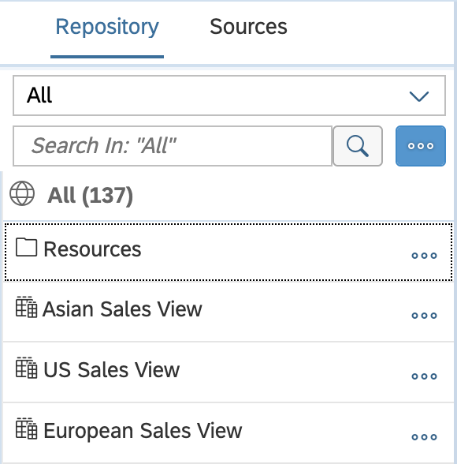

<!-- loio7d2b21d974e44bdc9d548cf7532b5a43 -->

<link rel="stylesheet" type="text/css" href="css/sap-icons.css"/>

# Using the Source Browser

You use the *Source Browser* to add objects as sources for your data flow, graphical view, SQL view, or intelligent lookup. In an E/R model you add objects to visualize them together in a diagram, including importing objects from connections and other sources, and prepare them for use in other editors.

The *Source Browser* is available in the left panel in each of these editors, and gives you access to all the objects that have been imported into or created in the space, and also to all the connections and other sources that are available in the space:

-   The *Repository* tab lists all the tables, views, and intelligent lookups that are available in the space \(including objects shared to the space\). You can filter and sort the list as follows:

    <table>
    <tr>
    <td valign="top">
    
    
    
    </td>
    <td valign="top">
    
    -   Select a *Collection*:
        -   *All* \(default\)
        -   *Recent* - Objects that you recently opened
        -   *My Objects* - Objects that you created
        -   *Shared* - Objects that are shared to your space
        -   *Favorites* - Objects that you have favorited

    -   Enter one or more characters in the *Search* field and press *Enter* \(or click *Search*\).

        As you type, the field will begin proposing objects and search strings. Select an object to open it directly. Click on a string to trigger a search on it.

    -   Click  \(More\) to access the *Sort* and *Filter* options.
    -   Click a folder in the list to drill down into and restrict your search to the folder.

    
    </td>
    </tr>
    </table>
    
-   The *Sources* tab lists all the connections and other data sources that have been integrated to the space from which you can import tables. These can include: 

    -   *Connections* - Lists all the connections that have been created in the space \(see [Integrating Data via Connections](https://help.sap.com/viewer/9f36ca35bc6145e4acdef6b4d852d560/DEV_CURRENT/en-US/eb85e157ab654152bd68a8714036e463.html "Connections provide access to data from a wide range of remote systems, cloud as well as on-premise, SAP as well as Non-SAP, and partner tools. They allow users assigned to a space to use objects from the connected remote system as source to acquire, prepare and access data from those sources in SAP Datasphere. In addition, you can use certain connections to define targets for replication flows.") :arrow_upper_right:\).

        You can browse and search on up to 1,000 objects per connection. To browse all available objects, hover over any schema and click  \(Import from Connection\) to open the *Import Objects from Connection* dialog \(see [Import Multiple Objects from a Connection](import-multiple-objects-from-a-connection-e720b13.md)\).

    -   Open SQL Schemas - Each Open SQL schema appears as a root node in this tab \(see [Integrating Data via Database Users/Open SQL Schemas](https://help.sap.com/viewer/9f36ca35bc6145e4acdef6b4d852d560/DEV_CURRENT/en-US/3de55a78a4614deda589633baea28645.html "Create a database user in your space to read and write directly to the SAP HANA Cloud database on which SAP Datasphere runs. Each database user has an Open SQL schema, which is attached to a space schema and provides a secure method for exchanging data with the space.") :arrow_upper_right:\).
    -   HDI Containers - Each SAP HDI container added to the space appears as a root node in this tab \(see [Exchanging Data with SAP SQL Data Warehousing HDI Containers](https://help.sap.com/viewer/9f36ca35bc6145e4acdef6b4d852d560/DEV_CURRENT/en-US/1aec7ca95af24208a61c1a444b249d95.html "Use SAP SQL Data Warehousing to build calculation views and other SAP HANA Cloud HDI objects directly in your SAP Datasphere run-time database and then exchange data between your HDI containers and your SAP Datasphere spaces. SAP SQL Data Warehousing can be used to bring existing HDI objects into your SAP Datasphere environment, and to allow users familiar with the HDI tools to leverage advanced SAP HANA Cloud features.") :arrow_upper_right:\).

