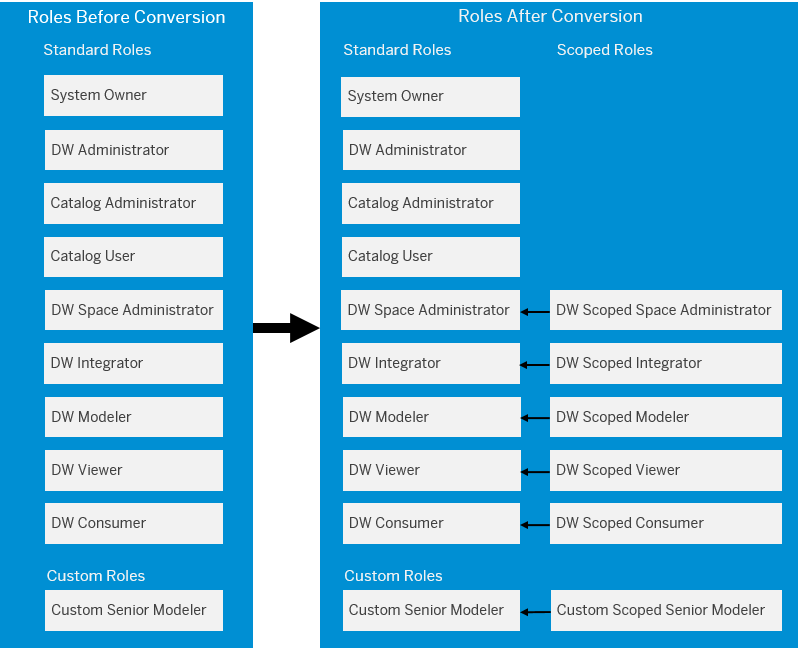

<!-- loio6f7c6dfa3cb249debb749c729025bae0 -->

# Automated Conversion to Scoped Roles

For SAP Datasphere tenants that were created before version 2023.21, the roles and user assignment to spaces have been converted so that users can continue to perform the same actions as before in their spaces.

> ### Caution:  
> Scoped roles and all related features will be rolled out to all tenants over the course of a number of versions. For more details, see SAP Note [3380409](https://launchpad.support.sap.com/#/notes/3380409).

The way a DW Administrator gives privileges to users to do certain actions in spaces has changed.

<table>
<tr>
<th valign="top">

Before Conversion

</th>
<th valign="top">

After Conversion

</th>
</tr>
<tr>
<td valign="top">

A DW Administrator assigned a role to a user and assigned the user as a member of a space.

As a consequence:

-   A user had the same one or more roles in all the spaces he was a member of.

-   A DW Administrator assigned users space by space by going in each space page.

</td>
<td valign="top">

A DW Administrator assigns a role to one or more users and one or more spaces within a new role: a scoped role.

As a consequence:

-   A user can have different roles in different spaces: be a modeler in space Sales Germany and Sales France and a viewer in space Europe Sales.

-   A DW Administrator can give a role to many users in many spaces, all in one place in a scoped role. See [Create a Scoped Role to Assign Privileges to Users in Spaces](create-a-scoped-role-to-assign-privileges-to-users-in-spaces-b5c4e0b.md).

    A DW Space Administrator can then manage users in their spaces and the changes are reflected in the scoped roles. See [Control User Access to Your Space](https://help.sap.com/viewer/be5967d099974c69b77f4549425ca4c0/cloud/en-US/9d59fe511ae644d98384897443054c16.html "You can assign users to your space and manage them.") :arrow_upper_right:.

</td>
</tr>
</table>

<a name="loio6f7c6dfa3cb249debb749c729025bae0__section_wmx_hmn_fyb"/>

## Converted Roles

You can now use global roles for tenant-wide actions and scoped roles for space-related actions.

The *Roles* page lists the same standard and custom roles as before the conversion, and in addition the scoped roles that have been automatically created.

-   DW Administrator, Catalog Administrator and Catalog User: these standard roles are considered as global roles. They now include only privileges that are global, which means privileges that apply to the tenant and are not space-related. For example, the DW Administrator role no more grants access to any of the modeling apps of SAP Datasphere \(such as Data Builder\).

    Users who previously had these roles are still assigned to them after conversion.

    Also, users who previously had the DW Administrator role and were members of certain spaces are assigned to the new DW Scoped Space Administrator role for those spaces they previously had access to.

-   A single scoped role is created for each standard role \(outside of DW Administrator, Catalog Administrator and Catalog User\) and each custom role and all the users who previously had that standard or custom role are assigned to the new scoped role but only for those spaces they previously had access to.

    > ### Note:  
    > All the spaces of the tenant are included in each scoped role created, but not all users are assigned to all spaces. See the example of scoped role below.

    For each standard or custom role, two roles are available after the conversion: the initial standard or custom role \(which acts as a template for the scoped role\) and the scoped role created.

    Each scoped role includes privileges which are now considered as scoped privileges.

-   Users who previously had the DW Space Administrator role are assigned to these 2 roles: the standard role DW Space Administrator and the new scoped role DW Scoped Space Administrator. Users who manage spaces primarily need scoped permissions to work with spaces, but they also need some global permissions \(such as Lifecycle when transporting content packages\). To provide such users with the full set of permissions they need, each space administrator is assigned to the scoped role DW Scoped Space Administrator to receive the necessary scoped privileges, and they are also assigned directly to the DW Space Administrator role in order to receive the additional global privileges.

> ### Note:  
> -   After conversion, if you want to do some adjustments in the converted roles to include certain privileges, we recommand that you create a custom role and include the privileges needed.
> 
> -   Specific case - no role assigned to a user: Before conversion, a DW Administrator assigned a user to certain spaces but did not assign a role to the user. As no role was assigned to the user, the user-to-spaces assignment is not kept after conversion.
> 
> -   Privileges and permissions are now either global or scoped. See [Privileges and Permissions](privileges-and-permissions-d7350c6.md).

<a name="loio6f7c6dfa3cb249debb749c729025bae0__section_fx4_1mn_fyb"/>

## Example of a Converted Scoped Role

In this example, users assigned to a custom role called « Senior Modeler » were members of certain spaces before the conversion, as shown below.

The custom role « Senior Modeler » has been converted to the scoped role « Custom Scoped Senior Modeler » and the users who previously had that custom role « Senior Modeler » are assigned to the scoped role but only for the spaces they previously had access to.

