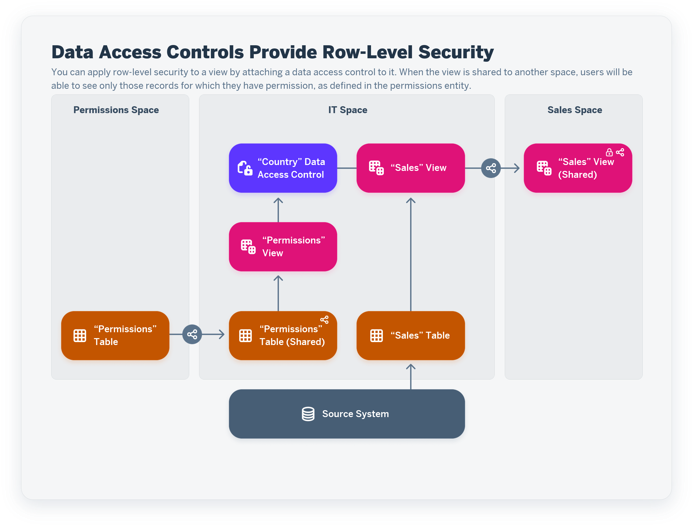

<!-- loioa032e51c730147c7a1fcac125b4cfe14 -->

# Securing Data with Data Access Controls

Data access controls allow you to apply row-level security to your objects. When a data access control is applied to a data layer view or a business layer object, any user viewing its data will see only the rows for which they are authorized, based on the specified criteria.

Your criteria are defined in a table or view that lists SAP Datasphere user IDs \(in the form required by your identity provider\) and assigns them to one or more criteria.

You can create one or more data access controls that consume this permissions entity, and select one or more columns in each data access control to specify the criteria that it will enforce. You can apply a single data access control to multiple views. Each view protected in this way will filter the results available in its data preview to only those rows meeting the criteria for the current user.

We recommend that you develop clear policies for securing data, and that you:

-   Secure data as soon as possible once it is ingested into SAP Datasphere and then only use the protected view going forward.
-   Recreate permissions/authorizations from the source system where possible, including via import for SAP BW \(see [Import SAP BW and SAP BW∕4HANA Analysis Authorizations](import-sap-bw-and-sap-bw-4hana-analysis-authorizations-f56e427.md)\).
-   Focus in particular on securing transactional data and sensitive master data.

> ### Note:  
> The row-level security provided by the data access control can be circumvented while the view remains in its space. It is enforced only when the view is:
> 
> -   Shared to another space, or
> -   Consumed outside the space in SAP Analytics Cloud.

This diagram shows a typical environment where a permissions entity is maintained by business users in one space and shared to a second space, where technical users create data access controls from it and apply them to views. These views are then shared to other spaces where they can be securely accessed by modelers and analysts:

In this environment:

-   The `Permissions` space users are a select group of business users who:
    -   Maintain the `Permissions` table \(see [Select a Table or View to Define Permissions](select-a-table-or-view-to-define-permissions-ffcae43.md)\), assigning users \(which, in this case, are identified by their email address\) to the appropriate country, department, and any other relevant criteria:

        <table>
        <tr>
        <th valign="top">

        User ID

        
        </th>
        <th valign="top">

        Country

        
        </th>
        <th valign="top">

        Department

        
        </th>
        </tr>
        <tr>
        <td valign="top">
        
        anne.archer@acme.com

        
        </td>
        <td valign="top">
        
        US

        
        </td>
        <td valign="top">
        
        Sales

        
        </td>
        </tr>
        <tr>
        <td valign="top">
        
        jennifer.jones@acme.com

        
        </td>
        <td valign="top">
        
        FR

        
        </td>
        <td valign="top">
        
        Sales

        
        </td>
        </tr>
        </table>
        
    -   Share the `Permissions` table to the `IT` space to use as a data source for data access controls.

        > ### Note:  
        > Tables and views shared to a space cannot be directly used as the permissions entity for a data access control. Modelers in the space receiving the shared object must encapsulate it in a view, which can then serve as the permissions entity for one or more data access controls.

-   The `IT` space users are technical users who:
    -   Use the shared `Permissions` table as the source for a `Permissions` view that they will use as a permissions entity in their space.
    -   Create a `Country` data access control, which uses the `Permissions` view as its permissions entity.
    -   Maintain a connection to a source system, from which they import the `Sales` table.
    -   Create a `Sales` view for use by business analysts, to which they apply the `Country` data access control.

        > ### Note:  
        > The row-level security provided by the `Country` data access control can still be circumvented while the view remains in the `IT` space.

    -   Share the `Sales` view to the `Sales` space where it can be used securely.

-   The `Sales` space users use the protected `Sales` view to do analytics on sales data:
    -   Anne is a data modeler in the US sales department. She connects to SAP Datasphere and combines the `Sales` view with other data. Whenever she previews data, she can only see US data.
    -   Jennifer is a business analyst in the French sales department. She connects to SAP Analytics Cloud, builds a story on the `Sales` view, and can only see French sales data.

For information about:

-   Applying a data access control to a data layer view, see [Apply a Data Access Control](https://help.sap.com/viewer/c8a54ee704e94e15926551293243fd1d/cloud/en-US/8f79fc80d6134a89a03837a205d340cd.html "You can apply one or more data access controls to a view to control the data that users will see based on the specified criteria.") :arrow_upper_right:.
-   Using a data access control to create authorization scenarios in the business layer, see [Authorization Scenario](https://help.sap.com/viewer/c8a54ee704e94e15926551293243fd1d/cloud/en-US/46d8c42e1b1f421c9735a7cbc6fdba60.html "Authorization scenarios allow modelers to define which data is relevant to a user's context. They are made available through business entities and can be used in consumption models for specific use-cases.") :arrow_upper_right:.
-   Persisting data in a view that has a data access control applied to it \(see [View Persistency and Data Access Control](../Data-Integration-Monitor/view-persistency-and-data-access-control-7a4a983.md)\).

> ### Note:  
> If you experience performance issues with a view protected by a data access control, we recommend enabling replication for source tables, particularly if any source contains more than 500,000 rows.

