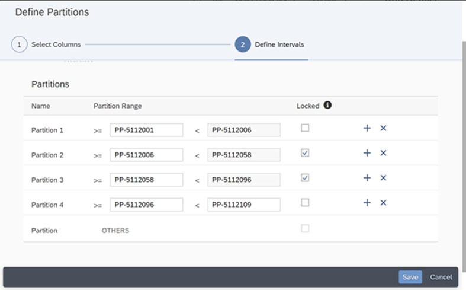
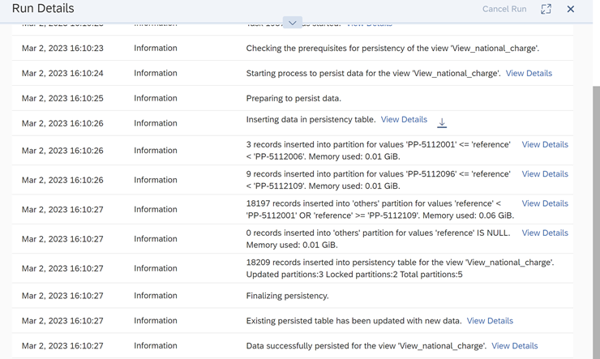

<!-- loio9b1b595054c34da5b67ac07595093f82 -->

<link rel="stylesheet" type="text/css" href="../css/sap-icons.css"/>

# Creating Partitions for Your Persisted Views

From the *View Persistency Monitor*- Details screen, you can create partitions on columns from your dataset and break your data down into smaller and more manageable parts to enable persistency on views with large data volume.

Persisting views with larger data volumes without having out-of-memory errors or high memory peaks can sometimes be a challenge for Data modelers. To avoid such situations, you can create partitions when persisting a view and thus enable partitioned data transfer of large datasets for supported connection types.

> ### Caution:  
> Some adapters used by the connected sources are not able to push down the filters for the partitioning. Thus, performance can be impacted by the number of partitions created.

<a name="loio9b1b595054c34da5b67ac07595093f82__section_f1q_y3w_wvb"/>

## Create Partitions for Your Persisted Views

You can create partitions from the *View Persistency Monitor* – Details screen:

1.  Click  for the view in virtual access mode you would like to persist and for which you need to create partitions for.
2.  Go to the *Partitions* tab and click *Define Partitions*.
3.  In the *Define Partitions* window, define your partitions:

    <table>
    <tr>
    <th valign="top">

    Property

    
    </th>
    <th valign="top">

    Description

    
    </th>
    <th valign="top">

    Comment

    
    </th>
    </tr>
    <tr>
    <td valign="top">

    *Column*

    
    </td>
    <td valign="top">

    Select the column from which the partition will be defined.

    
    </td>
    <td valign="top">

    It might happen that you can’t see all the columns available in your dataset because:

    -   Not all data types are supported for partitioning depending on your data sources:
        -   SAP HANA data: Only the following data types are supported

            -   Datetime types: DATE, TIME, TIMESTAMP, SECONDDATE

            -   Numeric types: TINYINT, SMALLINT, INT, BIGINT, DECIMAL\(p,s\)
            -   Character string: NVARCHAR

            For more information, see [Partitioning Limits](https://help.sap.com/viewer/f9c5015e72e04fffa14d7d4f7267d897/2021_01_QRC/en-US/8dd866a688ec4914a074727a2c800142.html).

    -   If you select a non-key column to define your partitions, you must ensure that the column value of a record in the source data is not changed while the view is persisted. Otherwise, data loading may fail because a record with the same key is persisted in two different partitions.
    -   You can't define partitions on columns, which contain amounts associated with a currency or quantities associated with a unit.
    -   You can't select a column containing analytical measures as partitioning-columns, only columns containing dimensions can be partitionned.
    -   For ODP data sources, only the following columns can be selected:

        -   Columns which support where clause of the SELECT statement.
        -   Columns equal to or less than 45 characters.

        > ### Restriction:  
        > For ODP data sources, you can create partitions on non-key columns only if your views have been deployed using a DP agent connection from release 2.5.4.1.
        > 
        > Moreover, if the repository entity comprises filter capabilities, you first need to refresh the view in the Data Builder, before you can create partitions.

    -   ABAP source: if you want to create partitions on columns from a view that go through an ABAP adapter, you need to replicate the table first.

    
    </td>
    </tr>
    <tr>
    <td valign="top">

    *Partitions range*

    
    </td>
    <td valign="top">

    Create the number of desired partitions by clicking  \(Add Partitions\) 

    Enter a range for each of them.

    > ### Caution:  
    > Ranges must not overlap

    Check the *Locked* option if you don't want to update a partition in the next run.

    > ### Caution:  
    > If locked partitions contain data filtered by authorizations provided by data access controls, you need to unlock partitions and load a new snaphot of data, whenever these authorizations are changed.

    An *OTHERS* partition is set by default. It contains data that is not covered by your defined ranges . For example, if rows have been inserted or modified since your last snapshot and they now don’t match any of the defined ranges. This *OTHERS* partitions can't be locked.

    
    </td>
    <td valign="top">

    > ### Note:  
    > -   Partitioning requires an in-depth knowledge of the values that are used or are valid for the chosen partitioning column.
    > -   Negative values are not valid for partition bounds of numeric columns and will be converted to 0 at runtime.
    > -   The low bound must be lower than the high bound. The order is checked according to the type of the partition column. Example: for string-like columns, '90' <= DOC\_ID < '100' is not valid, whereas '090' <= DOC\_ID < '100' is valid.
    > -   Values entered in the bounds for ABAP ODP remote tables must match the ABAP internal format: for example, enter "20210714" if the date is "July 14, 2021".

    
    </td>
    </tr>
    </table>
    

> ### Caution:  
> Once the partitions are created and the view is persisted, don't change data type of the column you have used to create the partition: if the data type is changed, it deletes the partitioning data.

<a name="loio9b1b595054c34da5b67ac07595093f82__section_xn3_4jw_wvb"/>

## Locking Partitions to Avoid Unnecessary Data Loads

When you think the data will no longer change, or no change is expected for a while, you can check this option to avoid unnecessary data load. However, if you change the partitions definition, even the locked partitions will be updated.

In the example below, I defined 2 partitions as *Locked* \(partitions 2 and 3\):

When I load a new snapshot, only partitions 1, 4, 5 and others are refreshed: 

<a name="loio9b1b595054c34da5b67ac07595093f82__section_xj2_n1x_wvb"/>

## Refreshing Single or Multiple Partitions

In some cases, you might want to refresh data for a single or for multiple partitions only, independently if they are locked or not. To do so, select the desired partitions and click *Load Data*.

> ### Example:  
> In the example below, I have selected 2 partitions. partition 1 is not locked and partition 2 is locked: .
> 
> Only the selected partitions are updated: 

> ### Note:  
> If you change the partition definition, then the next load will be a full load. No manual load will be possible, and the *Load Data* button will be disabled.

